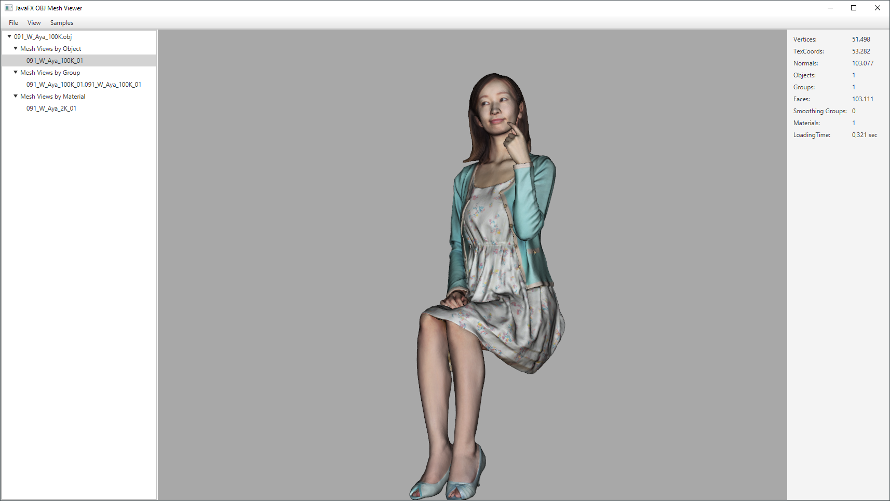

# javafx-objimporter

Parsing Wavefront OBJ files and creation of JavaFX mesh views 




### Sample code for creating a JavaFX mesh view from an OBJ file loaded via an URL:

```
ObjFileParser parser = new ObjFileParser(objFileURL, StandardCharsets.UTF_8);
ObjModel objModel = parser.parse();
// To build the mesh views for the groups inside the OBJ file:
Map<String, MeshView> meshes = MeshBuilder.build(objModel, MeshBuilder.BuildMode.BY_GROUP);
MeshView meshView = meshes.get("GroupID")
```

