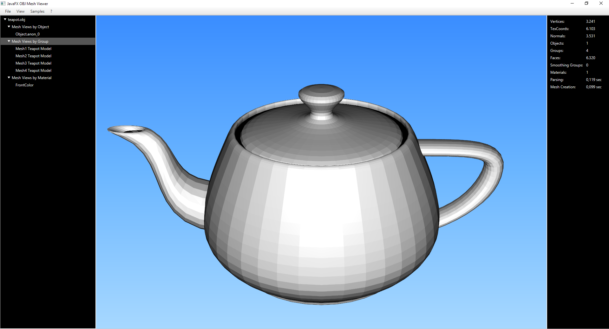
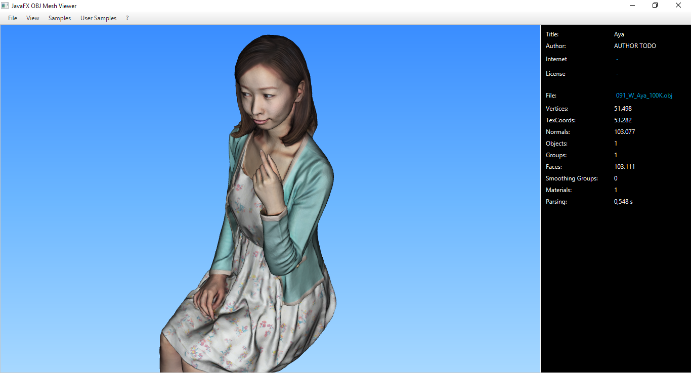
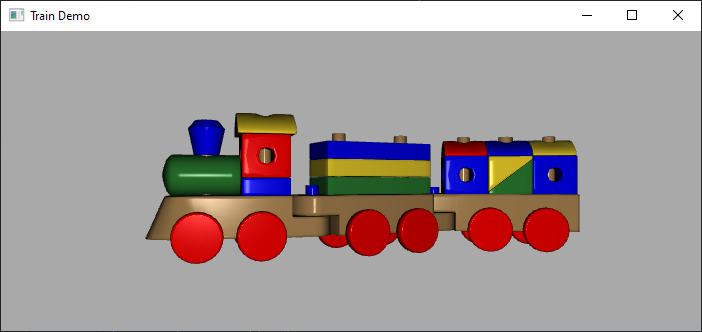

## javafx-objimporter

### Translating Wavefront OBJ files into JavaFX Phong materials and mesh views 






### Build and publish to local Maven repository

`./gradlew publishToMavenLocal`

(Publishing to Maven Central not yet available)

### Using the library from a Gradle project

```
dependencies {
    implementation("de.amr66.objimporter:objparser:0.0.1")
    implementation("de.amr66.objimporter:meshbuilder:0.0.1")
}

```
Your application's module-info.java must have the following entries:

```
requires de.amr.objparser;
requires de.amr.meshbuilder;

exports whatever.your.app.module.is.named;
```

### Adding your own sample models to the meshviewer application

The included mesh viewer application creates the folder `$HOME/.meshviewerfx/samples` under your home directory. 
To add your own samples, you have to create a subdirectory for each sample in this folder and register the sample in a TOC file named `toc.json`
which has to be placed in the folder above. 

The format of this file is like this:

```
[
  {
    "title": "Teapot",
    "author": "Martin Newell, Jim Blinn",
    "fileName": "teapot.obj",
    "path": "newell_teaset/",
    "downloadURL": "https://www.cs.utah.edu/~natevm/newell_teaset/newell_teaset.zip",
    "homepage": "https://graphics.cs.utah.edu/teapot/",
    "licenseType": "CC 4.0",
    "licenseURL": "https://creativecommons.org/licenses/by/4.0/legalcode",
    "initSettings": {
      "zoom": -10,
      "rotateX": 0,
      "rotateY": 0,
      "rotateZ": 0,
      "initialMeshSelection": "ALL_GROUPS",
      "wireframe": false,
      "autorotate": true
    }
  }
    
  ...more entries, separated by commata

]
```
Here, the `path` attribute must store the relative path to your model from the `samples` folder and should be terminated with a `/`.
In the `initSettings` object, you can specify the initial preview settings which may vary between samples such that the sample is e.g. zoomed
appropriately when displayed for the first time.

For the TOC file shown above, there must exist a folder `$HOME/.meshviewerfx/samples/newell_teaset` containing on OBJ file named `teapot.obj`.

For each registered sample, the menu "User Samples" will create an entry where you can select the OBJ file and preview it.

### A small sample application

Is it difficult to show a 3D model parsed from an OBJ file on the screen? Here a simple example application showing a toy train:

```
public class TrainDemoApp extends Application {

    @Override
    public void start(Stage stage) throws IOException {

        // Load the toy train sample from the resources folder
        final URL url = getClass().getResource("/samples/toy_train/toyTrain.obj");
        if (url == null) {
            Logger.error("Could not load obj file");
            return;
        }

        // Parse the OBJ file and create the JavaFX materials and mesh views
        final ObjModel model3D = new ObjFileParser(url, StandardCharsets.UTF_8).parse();
        final Collection<MeshView> meshViews = new MeshBuilder(model3D)
            .buildMeshViewsByMaterial().values();

        // Create the scene content
        final Group train = new Group(meshViews.toArray(MeshView[]::new));

        final Group world = new Group(train);
        // JavaFX coordinate system is upside-down, so flip the world
        final Transform upsideDown = new Rotate(180, Rotate.X_AXIS);
        world.getTransforms().add(upsideDown);

        // Camera looks at origin, take a step back
        final PerspectiveCamera camera = new PerspectiveCamera(true);
        camera.setTranslateZ(-60);

        final Scene scene = new Scene(world, 800, 600, true, SceneAntialiasing.BALANCED);
        scene.setCamera(camera);
        scene.setFill(Color.DARKGRAY);

        // Zoom in/out with "+" and "-" keys
        scene.setOnKeyPressed(event -> {
            switch (event.getCode()) {
                case PLUS  -> camera.setTranslateZ(camera.getTranslateZ() + 1);
                case MINUS -> camera.setTranslateZ(camera.getTranslateZ() - 1);
            }
        });

        // Display the scene
        stage.setScene(scene);
        stage.setTitle("Train Demo");
        stage.show();
    }
}
```



